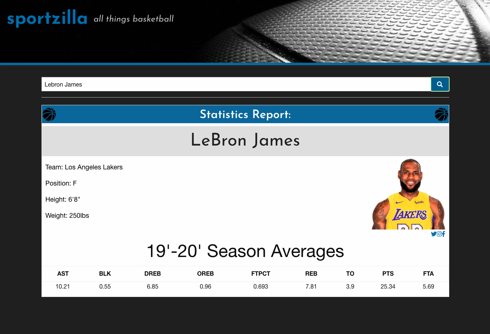

# Sportzilla: NBA Player Statistics 


## Overview
Welcome to our project! Our team has created a responsive website that provides statistics from the 2019-2020 NBA season for each user-searched player. This was achieved by integrating data received from multiple server-side API requests. 

# Technologies used Include

* HTML
* Javascript 
* Foundation CSS
* JQuery

# Direction for future development

* Add a selection bar that would be able to change the year that the user can search for
* Add more sports to expand our searches
* Add the ability to search for full team stats and not just the players
* Add functionality to view current or recent games


# The server-side APIs used in this project include:
* [balldontlie](https://www.balldontlie.io/#introduction)
* [TheSportsDB](https://www.thesportsdb.com/api.php)

# User Story

```
AS A fan of the NBA
I WANT an efficient way to view player statistics
SO THAT I will be well-informed for any sports-related endeavors
```

# Deployed Website

https://millsy4.github.io/sportz_project/
## Repository
https://github.com/Millsy4/sportz_project.git


# Screenshots



